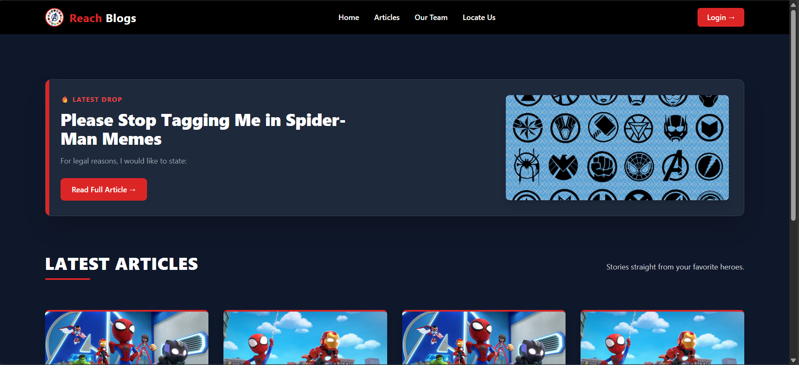

# 📝 Blogging Platform (Flask-Based CMS)

A role-based blogging platform built with Flask that supports content creation, user management, and administrative controls.  

This project was originally developed as a full-stack blog system and has recently been refactored and modernized for professional portfolio presentation.

---

## 🚀 Overview

This application is a content management system (CMS) that enables:

- 👤 Authors to create, edit, and manage blog posts
- 🛠 Administrators to manage users and site content
- 🌐 Public users to browse and read published articles

The system focuses on clean architecture, role-based access control, and a structured template design.

---

## 🧱 Tech Stack

- **Backend:** Flask (Python)
- **Frontend:** Jinja2 Templates + Tailwind CSS
- **Database:** SQL-based relational database
- **Authentication:** Role-based access control (Admin / Author)
- **Version Control:** Git

---

## 👤 Author Features

- Create new blog posts
- Edit existing posts
- Delete own posts
- Change account password
- Responsive dashboard interface

---

## 🛠 Admin Features

- View all published articles
- Delete articles (with confirmation handling)
- Add new authors
- Edit author credentials
- Delete authors (with confirmation handling)
- Change admin password
- Scrollable and structured content management panels

---

## 🏠 Homepage Features

- Featured latest article section
- Grid layout for recent posts
- Clean and responsive UI
- Consistent design system across pages

---

## 🎨 UI & Refactor Improvements

The project was recently enhanced to improve:

- Unified layout structure across user and admin roles
- Improved readability and editor layout
- Safer delete operations via confirmation prompts
- Scrollable admin management panels
- Better visual hierarchy on homepage
- Responsive layout refinements

The goal of the refactor was to improve usability, maintainability, and presentation quality.

---

## 🔐 Role-Based Access

| Role   | Capabilities |
|--------|-------------|
| Author | Manage own blog posts |
| Admin  | Manage users and all content |

---

## 🖼 Application Preview

### Homepage

  

### Admin Dashboard

  

---

## Documentation

Detailed UI breakdown with screenshots:

👉 [User Interface Documentation](docs/interfaces.md)

## 📌 Design Decisions

- Separation of layout templates for maintainability
- Role-based route protection
- Simple confirmation prompts for destructive actions
- Structured template inheritance using Jinja2
- Focus on clean UI/UX principles

---

## 📈 Potential Future Enhancements

- Pagination for large datasets
- Search functionality in admin dashboard
- Rich text or Markdown editor
- Image upload per article
- REST API layer for frontend decoupling
- Deployment with Docker or CI/CD integration

---

## 📄 License

For educational and portfolio use.
