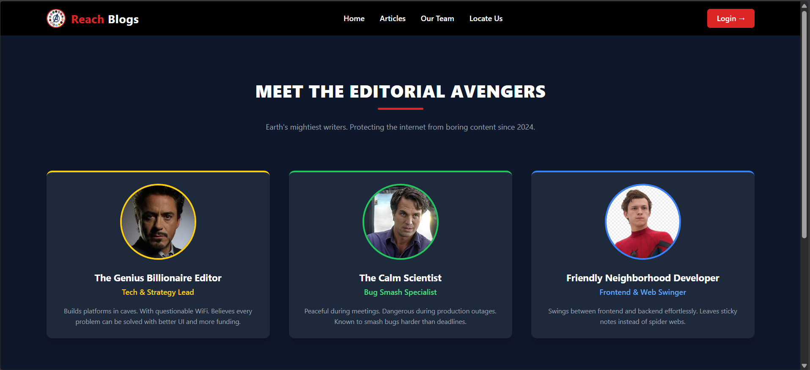
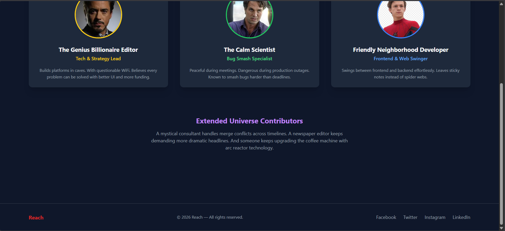
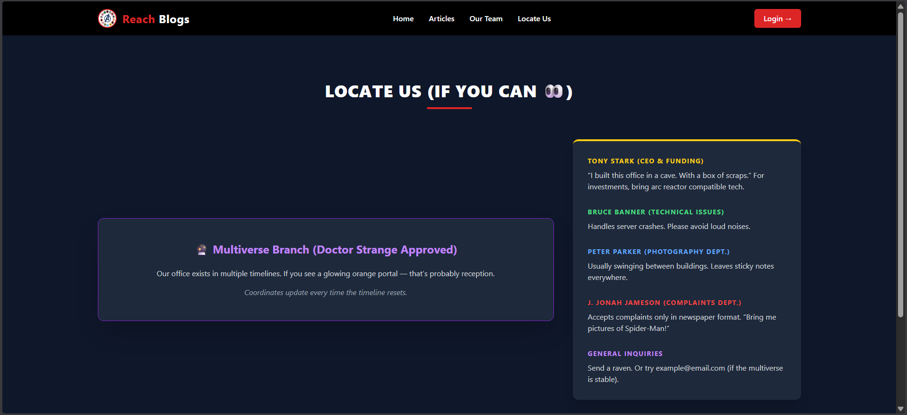
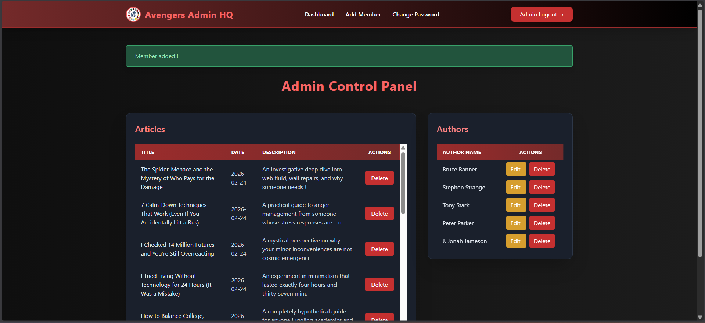
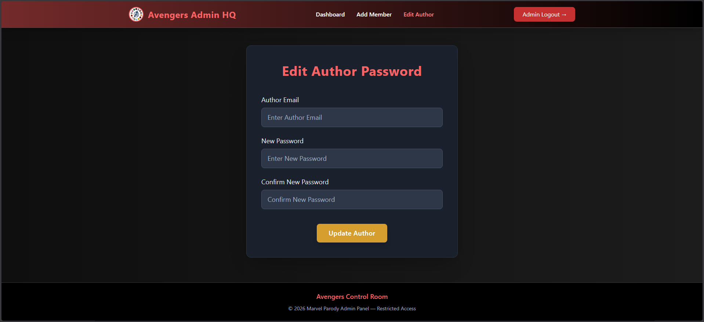
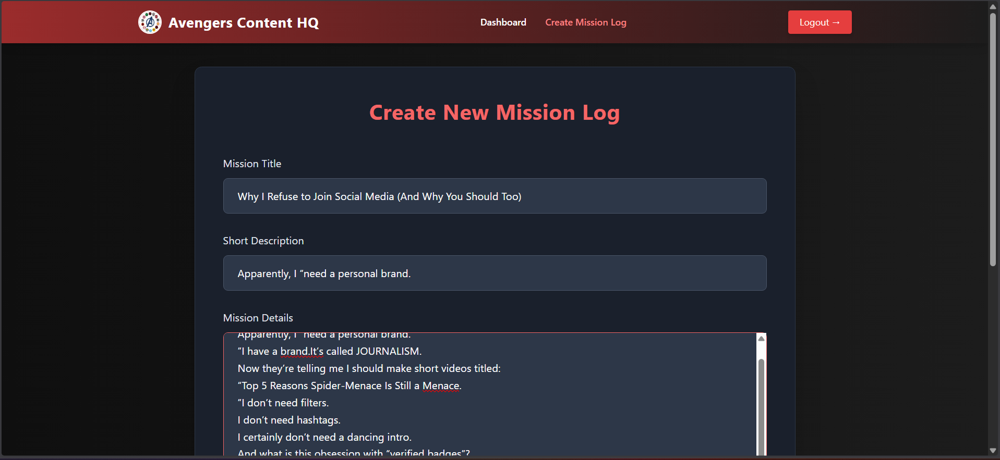
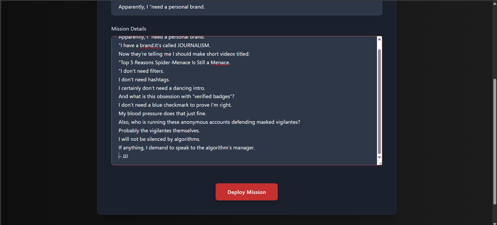
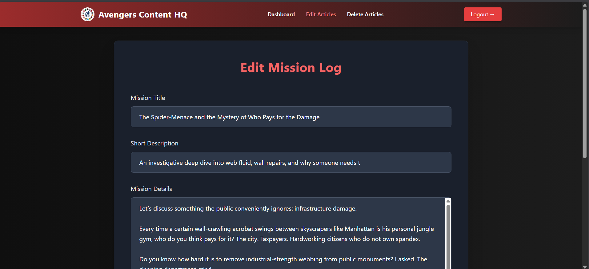
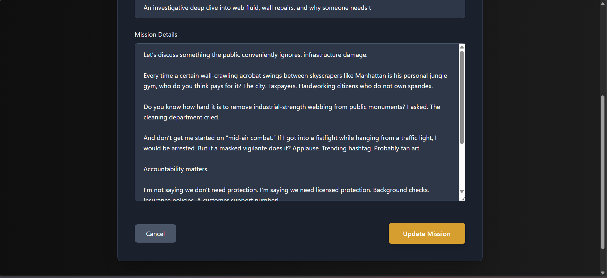
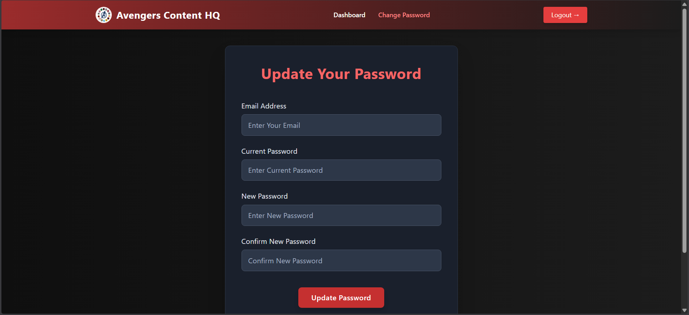

# User Interface Documentation

This document provides a high-level overview of the user interface structure for the Blogging Platform.

---

# 1. Public / Reader Interface

**These pages are available for every one and these pages can be accessed without logging in.** 

## Homepage

  

  <em>Homepage overview : The latest article will be shown here</em>

.

  

  <em>Homepage overview : Recent articles will be shown here</em>

## Article View

  

  <em> Article page Overview : All the articles will be listed here</em>

  

  <em> Article page Overview : All the articles will be listed here</em>

## Article reading page

  

  <em> Article reading page  :  Readers can read the the articles in this page</em>

## Blogger's Detail

  

  

  <em> About page : A page to display the details of the organization using website</em>

  

  <em> Locate Us : A page to display details about the blog writers</em>

## Login Page

  

  <em> Login Page  :  Blog writers and Admin can use this page to login into the website</em>

---
# 2. Admin Interface

**These pages belong to admin for management of  blog writers and content of the website.** 

  

  <em>Admin login : Admin can use the login page to login into the website </em>

## Admin Dashboard

  

  <em>Admin dashboard : Dashboard shows the list of articles and list of Blog writers </em>

---

## User Management

  
 >

  <em>Author management : Admin can add author by creating their account </em>

  
 >

  <em>Author management : After adding author confirmation message will be shown </em>

  
 >

  <em>Author management : Admin can change password if account holders forget password </em>

  
 >

  <em>Author management : Admin can delete author ( confirmation will be asked before deleting ) </em>

  
 >

  <em>Author management : After deleting author confirmation message will be shown </em>

## Content Management

  

  <em>Content Managment : Admin can delete the articles from the website ( confirmation will be asked ) </em>

## Security Console

  

  <em>Admin Account Managment : admin can change his password </em>

# 3. User (Author) Interface

**These pages belong to Author for management of  blogs and their account.** 

  

  <em>Author login : Author can use the login page to login into the website </em>

## User Dashboard

  

  <em>Author dashboard : Dashboard shows all the blogs written by the author.</em>

---

## Content Management (Add / Edit Article)

  

  

  <em>Author content managment: author can write and add blogs from add blogs page</em>

  

  <em>Author content managment: After uploading blog author gets a notification on dashboard</em>

  

  

  <em>Author content managment: After uploading blog author can edit the content of the blog </em>

  

  <em>Author content managment: Author can delete any blogs just by clicking on the 'delete' button infront of article title in dashboard </em>

  
 >

  <em>Author Security  management : Author can change password if needed </em>

